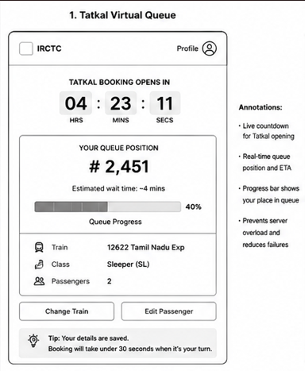
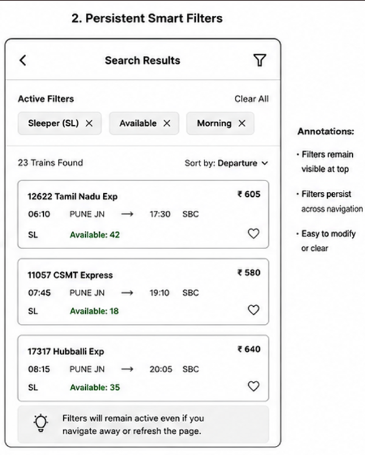
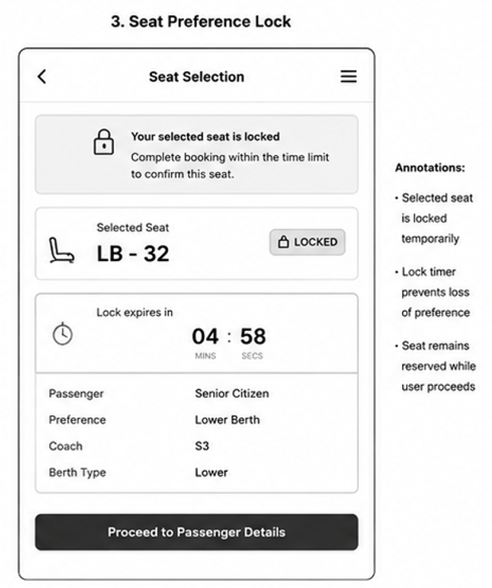
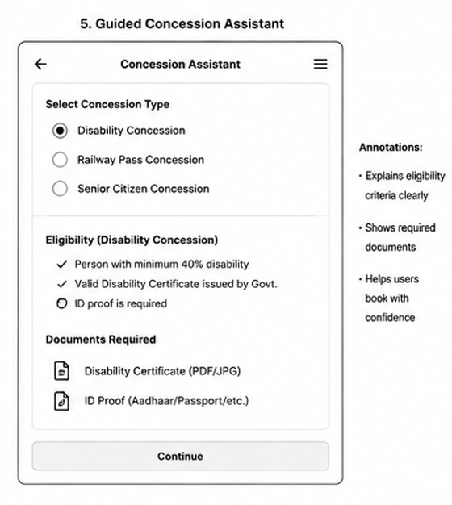
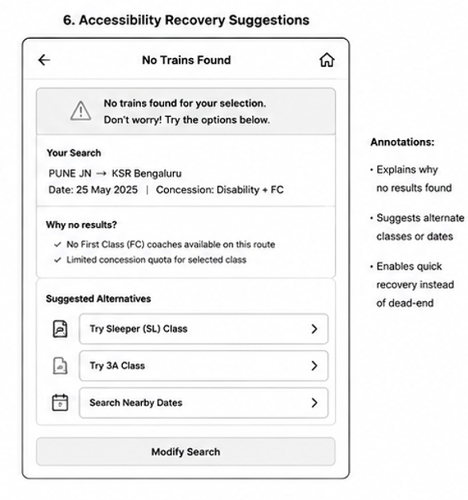

# Feature Spec 1: Tatkal Virtual Queue System

### Problem Statement

Users attempting Tatkal bookings experience crashes, timeouts, and server errors at 10:00 AM due to extremely high traffic. This affects millions of users daily and often results in lost booking opportunities despite users completing all required steps.

### Current State (from Part A)

The booking flow breaks when users click "Book Now" at 10:00 AM. The platform becomes unresponsive, sessions expire, and users receive no indication of queue position or request status.

### Proposed Solution

Introduce a Virtual Tatkal Queue System.

Instead of all users hitting the booking endpoint simultaneously, users are placed into a queue before Tatkal opens. They receive a queue number, estimated wait time, and real-time progress updates.

### Proposed User Flow — Step by Step

1. User selects train and Tatkal quota.
2. User enters passenger details before 10:00 AM.
3. User joins virtual queue.
4. System assigns queue position.
5. User sees estimated wait time.
6. Queue progresses automatically.
7. User receives booking slot notification.
8. User completes booking within allocated time window.
9. Booking confirmation is generated.

### Technical Implementation Plan

**System components affected:**

* Frontend booking flow
* Booking backend
* Session management
* Database
* Notification service

**New data requirements:**

* Queue ID
* Queue position
* Queue timestamp
* Booking slot expiry time

**API changes:**

* POST /queue/join
* GET /queue/status
* POST /queue/confirm

**Frontend changes:**

* Queue status screen
* Real-time progress indicator
* Slot-expiry timer

**Third-party services (if any):**

* WebSocket service for live queue updates

### Success Metrics

* Tatkal booking success rate increases from 40% to 70%.
* Server errors reduced by 80%.
* User refresh attempts reduced by 90%.

### Edge Cases and Constraints

* User disconnects while waiting.
* Queue position expires.
* Railway backend availability delays.
* Graceful fallback to standard booking if queue service fails.

---

# Feature Spec 2: Persistent Smart Search Filters

### Problem Statement

Users lose applied search filters during train browsing, causing confusion and additional effort. Search results may not consistently reflect selected filters.

### Current State (from Part A)

Users apply class and availability filters, but after navigation or refresh, filters reset and users must repeat their search process.

### Proposed Solution

Create Persistent Smart Filters that remain active across navigation and automatically reapply when results refresh.

### Proposed User Flow — Step by Step

1. User searches trains.
2. User applies filters.
3. Filter chips appear at the top.
4. User opens train details.
5. User returns to results.
6. Filters remain active.
7. Updated results respect selected filters.
8. User clears filters manually if desired.

### Technical Implementation Plan

**System components affected:**

* Search frontend
* Search API
* Browser session storage

**New data requirements:**

* User filter preferences
* Session filter state

**API changes:**

* GET /search?filters=
* Save filter metadata in responses

**Frontend changes:**

* Persistent filter chips
* Session state management

**Third-party services (if any):**

* None

### Success Metrics

* Filter reapplication rate reaches 100%.
* Search completion time reduced by 30%.
* User satisfaction improves.

### Edge Cases and Constraints

* Expired sessions.
* Availability changes after refresh.
* Mobile browser storage limitations.

---

# Feature Spec 3: Seat Preference Lock System

### Problem Statement

Passengers selecting specific berths lose their preferences during booking, particularly elderly passengers and families requiring lower berths.

### Current State (from Part A)

Seat selection is made successfully but resets before booking confirmation, forcing users into auto-allocation.

### Proposed Solution

Implement a Seat Preference Lock System.

Selected berths remain reserved during booking and visibly follow the user through all booking steps.

### Proposed User Flow — Step by Step

1. User opens seat map.
2. User selects preferred berth.
3. System temporarily locks berth.
4. User proceeds to passenger details.
5. Selected berth remains visible.
6. User completes booking.
7. Final confirmation displays selected berth.

### Technical Implementation Plan

**System components affected:**

* Seat map service
* Booking backend
* Passenger service

**New data requirements:**

* Locked seat ID
* Lock timestamp
* Lock expiration time

**API changes:**

* POST /seat/lock
* POST /seat/release
* GET /seat/status

**Frontend changes:**

* Locked-seat badge
* Seat status persistence

**Third-party services (if any):**

* None

### Success Metrics

* Seat preference retention reaches 95%.
* Berth-related complaints reduced by 70%.
* Mobile booking completion improves.

### Edge Cases and Constraints

* Lock timeout after inactivity.
* Multiple users selecting the same berth.
* Backend seat availability changes.
* Automatic release if booking fails.

---

# Feature Spec 4: Auto Availability Loader

### Problem Statement

Users searching for trains cannot immediately view seat availability because the platform displays separate "Refresh" buttons for each class. This increases booking time and creates unnecessary friction for users comparing travel options.

### Current State (from Part A)

After train results load, users must manually click "Refresh" for every class (SL, 3A, 2A, etc.) before availability information becomes visible.

### Proposed Solution

Automatically load seat availability for all visible classes immediately after search results appear.

Instead of displaying multiple Refresh buttons, availability information will load progressively and display loading placeholders while data is being fetched.

### Proposed User Flow — Step by Step

1. User enters journey details.
2. User clicks Search.
3. Train results appear.
4. Availability data begins loading automatically.
5. User sees loading placeholders.
6. Availability information appears without manual action.
7. User compares classes instantly.
8. User selects preferred class and proceeds.

### Technical Implementation Plan

**System components affected:**

* Search frontend
* Availability API
* Search results rendering service

**New data requirements:**

* Availability cache timestamp
* Last availability refresh timestamp

**API changes:**

* GET /availability/bulk
* Returns availability for all visible classes in a single request

**Frontend changes:**

* Skeleton loading state
* Auto-fetch on page load
* Bulk availability display component

**Third-party services (if any):**

* Redis cache layer for frequently searched routes

### Success Metrics

* Reduce clicks required to compare classes by 80%.
* Reduce train selection time by 40%.
* Improve search satisfaction score.

### Edge Cases and Constraints

* Availability changes while user is viewing results.
* Cache expiration during peak traffic.
* Slow railway backend responses.
* Fallback to manual refresh if availability service is unavailable.

---

# Feature Spec 5: Guided Concession Assistant

### Problem Statement

Users see concession-related options such as disability concession and railway pass concession but receive no explanation about eligibility, required documents, or benefits.

### Current State (from Part A)

Users encounter concession options during booking but must leave the platform or search help pages to understand whether they qualify.

### Proposed Solution

Add a Guided Concession Assistant that explains eligibility, required documentation, benefits, and booking rules directly within the booking flow.

### Proposed User Flow — Step by Step

1. User opens booking page.
2. User notices concession options.
3. User clicks "Learn More."
4. Assistant panel opens.
5. User selects concession type.
6. Eligibility requirements are displayed.
7. Required documents are shown.
8. User confirms eligibility.
9. Booking proceeds with confidence.

### Technical Implementation Plan

**System components affected:**

* Booking frontend
* Help content management system
* User profile service

**New data requirements:**

* Concession eligibility metadata
* Documentation requirements

**API changes:**

* GET /concession/info
* GET /concession/eligibility

**Frontend changes:**

* Info modal
* Contextual help panel
* Eligibility wizard

**Third-party services (if any):**

* None

### Success Metrics

* Reduce concession-related support queries by 50%.
* Increase concession usage completion rate.
* Improve accessibility satisfaction scores.

### Edge Cases and Constraints

* Frequent policy changes.
* Government regulation updates.
* Missing documentation.
* Offline access limitations.

---

# Feature Spec 6: Accessibility Recovery Suggestions

### Problem Statement

Users selecting disability concession filters can receive zero search results without any explanation or guidance. This creates a dead-end experience for users who rely on accessibility-related booking options.

### Current State (from Part A)

When no trains match selected concession and class combinations, users receive a generic "No trains available" message and must manually experiment with different settings.

### Proposed Solution

Introduce Accessibility Recovery Suggestions.

When no results are found, the system explains the reason and provides alternative classes, nearby dates, or other available trains.

### Proposed User Flow — Step by Step

1. User selects disability concession.
2. User searches trains.
3. No matching trains are found.
4. Recovery screen appears.
5. System explains possible reasons.
6. Alternative classes are suggested.
7. Alternative dates are suggested.
8. User selects recommended option.
9. Search results update automatically.

### Technical Implementation Plan

**System components affected:**

* Search engine
* Concession service
* Recommendation engine

**New data requirements:**

* Alternative route mapping
* Class recommendation data
* Concession availability matrix

**API changes:**

* GET /search/recovery-options
* GET /concession/alternatives

**Frontend changes:**

* Empty-state recommendation card
* Suggested alternatives panel
* Quick retry buttons

**Third-party services (if any):**

* None

### Success Metrics

* Reduce abandoned accessibility searches by 60%.
* Increase successful concession bookings.
* Reduce repeat search attempts.

### Edge Cases and Constraints

* No alternatives genuinely exist.
* Backend recommendation service unavailable.
* Railway concession rules change.
* Fallback to standard search results if recommendation service fails.

---

# Wireframe References

### Wireframe 1

Caption: Virtual Tatkal Queue with live position, ETA, and progress tracking.

### Wireframe 2

Caption: Search results page showing saved filter chips and persistent filter state.

### Wireframe 3

Caption: Seat selection page displaying locked berth confirmation.

### Wireframe 4

Caption: Search results with automatic availability loading and skeleton placeholders.

### Wireframe 5

Caption: Guided concession assistant showing eligibility and required documents.

### Wireframe 6

Caption: Recovery screen suggesting alternative classes and travel options when no results are found.
